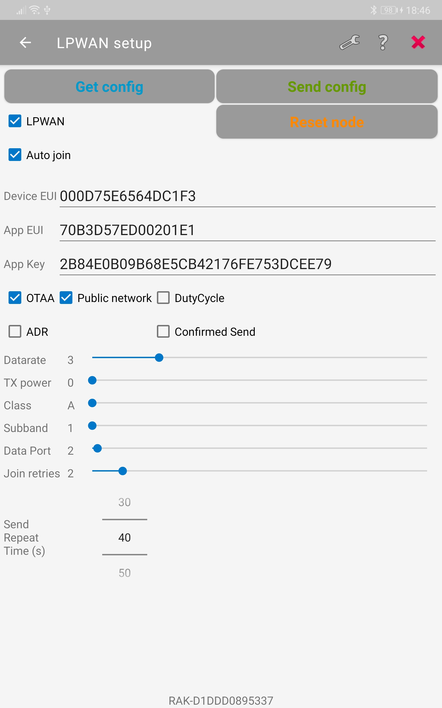
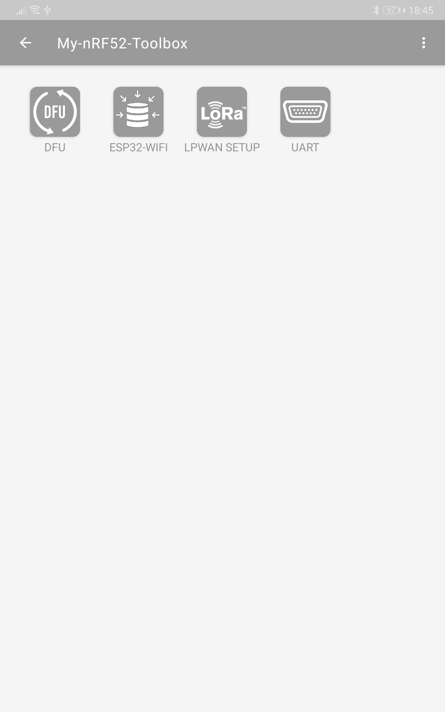
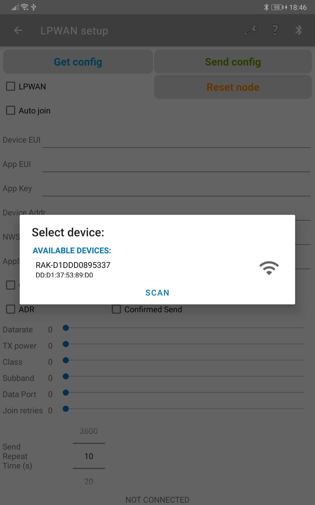

|   |   |   |
| :-: | :-: | :-: |
|  |  |  |
# WORK IN PROGRESS => NO GUARANTEE THAT IT WORKS ON YOUR PHONE

When you have several LoRa P2P or LoRaWAN nodes with identical firmware a feature to configure the nodes in the field is required. Otherwise you would have to compile the firmware several times with the different configurations.

Many RAK modules use the _**Serial / USB port**_ and _**AT commands**_ to do such a field configuration. But as the RAK4631 has BLE, I wanted to go a different way. Instead of using AT commands, I implemented a custom BLE service and characteristic to receive and send the LoRa/LoRaWAN configuration to an Android phone.

This is still in testing and the example code needs improvement.  

----  
## Principle
Instead of hard coding LoRa / LoRaWAN settings in the code, the firmware is using the internal flash to store and read the configurations.  
In a new node, this configuration is set to _**standard**_ values and the node will not automatically try to connect to the LoRa network. After power up of the node, you can connect to the node from an Android application over BLE to setup the node to a different configuration.  

----
## Requirements  
WisBlock RAK4631    
Android phone or tablet    
Android application [My nRF52 Toolbox](https://play.google.com/store/apps/details?id=tk.giesecke.my_nrf52_tb) to connect to the RAK4631 for configuration.    

If you want to compile the Android app by yourself, you can find the source code on [Github](https://github.com/beegee-tokyo/My-nRF52-Toolbox).

----
## PLEASE READ FIRST
- If you flash this example the first time, there are no LoRaWAN parameters saved in the Flash memory and everything is set to some default values.      
Before your device can use LoRa P2P or connect to a LoRaWAN server you have to connect with [My nRF52 Toolbox](https://play.google.com/store/apps/details?id=tk.giesecke.my_nrf52_tb), enter the parameters for your node and save them on the device.  
- The device will not start LoRa P2P communication or connect to a LoRaWAN server until you check the _**Auto Join**_ checkbox in the Android application
- If _**Auto Join**_ is enabled, the node will connect and send a dummy packet (_**HELLO**_) in the specified frequency. You can set the frequency with the _**Send Repeat Time (s)**_ option.
- The Android app testing is not finished and there are problems with some phones that cannot find the RAK4631 nodes. I am working to solve this problem, but I am depending on Nordic's nRF52 Android libraries.    
- LoRaWAN settings and parameters are only checked for general validity, but not if they are matching with your Region Specification
- LoRaWAN region cannot be changed (_**yet**_) with this app. The LoRaWAN region still needs to be selected during compilation!
- The Android application uses the `valid_mark_2` in the [data structure](#structures-of-the-saved-settings) to know whether the connected device is a P2P only, LoRaWAN only or combined P2P/LoRaWAN device.

----
## Configurable parameters
### General settings
- Switch between LoRa P2P and LoRaWAN mode
- Enable/disable auto join in LoRaWAN mode

----
### LoRaWAN settings
- Switch between OTAA and ABP join mode in LoRaWAN mode
- Set network type public or private
- Enable or disable ADR
- Enable or disable confirmed sending
- Enable or disable Dutycycle
- Set Datarate (no check if valid for Region)
- Set TX power (no check if valid for Region)
- Set node class
- Set frequency subband (no check if valid for Region)
- Set fPort for sending
- Set number of join retries
- Set automatic sending repeat time (experimental)

----
#### LoRaWAN OTAA settings
- Enter Device EUI
- Enter Application EUI
- Enter Application Key

----
<center></center>

----
#### LoRaWAN ABP settings
- Enter Device Address
- Enter Network Session Key
- Enter Application Session Key

----
<center></center>

----
### LoRa P2P settings
- Select frequency for sending
- Set TX power (no check if valid for Region)
- Set bandwidth
- Set spreading factor
- Set coding rate
- Set preamble length
- set symbol timeout

----
<center></center>

----
## Structures of the saved settings
Because nodes are often used for LoRa P2P or for LoRaWAN and not so often nodes that switch between the modes, there are three different structures.
- P2P mode only, see example [nrf52-LoRaP2P-Config-BLE](./nrf52-LoRaP2P-Config-BLE). `valid_mark_2` is set to `0x56`
- LoRaWAN mode only, see example [nrf52-LoRaWAN-Config-BLE](./nrf52-LoRaWAN-Config-BLE). `valid_mark_2` is set to `0x57`
- P2P and LoRaWAN mode, see example [nrf52-LoRa-Config-BLE](./nrf52-LoRa-Config-BLE). `valid_mark_2` is set to `0x55`

This helps to create smaller code in case you need only P2P or only LoRaWAN mode.

----
## Structure of the combined P2P and LoRaWAN settings
The settings are stored in a structure and saved in the flash as binary data. The data structure looks like:  
```cpp
#define LORAWAN_DATA_MARKER 0x55
struct s_lorawan_settings
{
	// Just a marker for the Flash
	uint8_t valid_mark_1 = 0xAA; 
	// Just a marker for the Flash
	uint8_t valid_mark_2 = LORAWAN_DATA_MARKER; 
	// OTAA Device EUI MSB
	uint8_t node_device_eui[8] = {0x00, 0x0D, 0x75, 0xE6, 0x56, 0x4D, 0xC1, 0xF3};
	// OTAA Application EUI MSB
	uint8_t node_app_eui[8] = {0x70, 0xB3, 0xD5, 0x7E, 0xD0, 0x02, 0x01, 0xE1};
	// OTAA Application Key MSB
	uint8_t node_app_key[16] = {0x2B, 0x84, 0xE0, 0xB0, 0x9B, 0x68, 0xE5, 0xCB, 0x42, 0x17, 0x6F, 0xE7, 0x53, 0xDC, 0xEE, 0x79};
	// ABP Device Address MSB
	uint32_t node_dev_addr = 0x26021FB4;
	// ABP Network Session Key MSB
	uint8_t node_nws_key[16] = {0x32, 0x3D, 0x15, 0x5A, 0x00, 0x0D, 0xF3, 0x35, 0x30, 0x7A, 0x16, 0xDA, 0x0C, 0x9D, 0xF5, 0x3F};
	// ABP Application Session key MSB
	uint8_t node_apps_key[16] = {0x3F, 0x6A, 0x66, 0x45, 0x9D, 0x5E, 0xDC, 0xA6, 0x3C, 0xBC, 0x46, 0x19, 0xCD, 0x61, 0xA1, 0x1E};
	// Flag for OTAA or ABP
	bool otaa_enabled = true;
	// Flag for ADR on or off
	bool adr_enabled = false;
	// Flag for public or private network
	bool public_network = true;
	// Flag to enable duty cycle
	bool duty_cycle_enabled = false;
	// In milliseconds: 2 * 60 * 1000 => 2 minutes
	uint32_t send_repeat_time = 120000;
	// Number of join retries
	uint8_t join_trials = 5;
	// TX power 0 .. 22
	uint8_t tx_power = 22;
	// Data rate 0 .. 15 (validity depnends on Region)
	uint8_t data_rate = 3;
	// LoRaWAN class 0: A, 2: C, 1: B is not supported
	uint8_t lora_class = 0;
	// Subband channel selection 1 .. 9
	uint8_t subband_channels = 1;
	// Flag if node joins automatically after reboot
	bool auto_join = false;
	// Data port to send data
	uint8_t app_port = 2;
	// Flag to enable confirmed messages
	lmh_confirm confirmed_msg_enabled = LMH_UNCONFIRMED_MSG;
	// Fixed LoRaWAN lorawan_region (depends on compiler option)
	uint8_t lorawan_region = 1;
	// Flag for LoRaWAN or LoRa P2P
	bool lorawan_enable = true;
	// Frequency in Hz
	uint32_t p2p_frequency = 923300000;
	// Tx power 0 .. 22
	uint8_t p2p_tx_power = 22;
	// Bandwidth 0: 125 kHz, 1: 250 kHz, 2: 500 kHz, 3: Reserved
	uint8_t p2p_bandwidth = 0;
	// Spreading Factor SF7..SF12
	uint8_t p2p_sf = 7;
	// Coding Rate 1: 4/5, 2: 4/6, 3: 4/7, 4: 4/8
	uint8_t p2p_cr = 1;
	// Preamble length
	uint8_t p2p_preamble_len = 8;
	// Symbol timeout
	uint16_t p2p_symbol_timeout = 0;
	// Command from BLE to reset device
	bool resetRequest = true;
};
```

----
## Structure of the P2P settings
The settings are stored in a structure and saved in the flash as binary data. The data structure looks like:  
```cpp
#define LORA_P2P_DATA_MARKER 0x56
struct s_lorap2p_settings
{
	uint8_t valid_mark_1 = 0xAA;				 // Just a marker for the Flash
	uint8_t valid_mark_2 = LORA_P2P_DATA_MARKER; // Just a marker for the Flash

	// OTAA Device EUI MSB
	// Symbol timeout
	uint16_t p2p_symbol_timeout = 0;
	// Send repeat time in milliseconds: 2 * 60 * 1000 => 2 minutes
	uint32_t send_repeat_time = 120000;
	// Frequency in Hz
	uint32_t p2p_frequency = 923300000;
	// Tx power 0 .. 22
	uint8_t p2p_tx_power = 22;
	// Bandwidth 0: 125 kHz, 1: 250 kHz, 2: 500 kHz, 3: Reserved
	uint8_t p2p_bandwidth = 0;
	// Spreading Factor SF7..SF12
	uint8_t p2p_sf = 7;
	// Coding Rate 1: 4/5, 2: 4/6, 3: 4/7, 4: 4/8
	uint8_t p2p_cr = 1;
	// Preamble length
	uint8_t p2p_preamble_len = 8;
	// Flag if node joins automatically after reboot
	bool auto_join = false;
	// Command from BLE to reset device
	bool resetRequest = true;
};
```


----
## Structure of the LoRaWAN settings
The settings are stored in a structure and saved in the flash as binary data. The data structure looks like:  
```cpp
#define LORAWAN_DATA_MARKER 0x57
struct s_lorawan_settings
{
	uint8_t valid_mark_1 = 0xAA;				// Just a marker for the Flash
	uint8_t valid_mark_2 = LORAWAN_DATA_MARKER; // Just a marker for the Flash

	// Flag if node joins automatically after reboot
	bool auto_join = false;
	// Flag for OTAA or ABP
	bool otaa_enabled = true;
	// OTAA Device EUI MSB
	uint8_t node_device_eui[8] = {0x00, 0x0D, 0x75, 0xE6, 0x56, 0x4D, 0xC1, 0xF3};
	// OTAA Application EUI MSB
	uint8_t node_app_eui[8] = {0x70, 0xB3, 0xD5, 0x7E, 0xD0, 0x02, 0x01, 0xE1};
	// OTAA Application Key MSB
	uint8_t node_app_key[16] = {0x2B, 0x84, 0xE0, 0xB0, 0x9B, 0x68, 0xE5, 0xCB, 0x42, 0x17, 0x6F, 0xE7, 0x53, 0xDC, 0xEE, 0x79};
	// ABP Network Session Key MSB
	uint8_t node_nws_key[16] = {0x32, 0x3D, 0x15, 0x5A, 0x00, 0x0D, 0xF3, 0x35, 0x30, 0x7A, 0x16, 0xDA, 0x0C, 0x9D, 0xF5, 0x3F};
	// ABP Application Session key MSB
	uint8_t node_apps_key[16] = {0x3F, 0x6A, 0x66, 0x45, 0x9D, 0x5E, 0xDC, 0xA6, 0x3C, 0xBC, 0x46, 0x19, 0xCD, 0x61, 0xA1, 0x1E};
	// ABP Device Address MSB
	uint32_t node_dev_addr = 0x26021FB4;
	// Send repeat time in milliseconds: 2 * 60 * 1000 => 2 minutes
	uint32_t send_repeat_time = 120000;
	// Flag for ADR on or off
	bool adr_enabled = false;
	// Flag for public or private network
	bool public_network = true;
	// Flag to enable duty cycle
	bool duty_cycle_enabled = false;
	// Number of join retries
	uint8_t join_trials = 5;
	// TX power 0 .. 15
	uint8_t tx_power = 0;
	// Data rate 0 .. 15 (validity depnends on Region)
	uint8_t data_rate = 3;
	// LoRaWAN class 0: A, 2: C, 1: B is not supported
	uint8_t lora_class = 0;
	// Subband channel selection 1 .. 9
	uint8_t subband_channels = 1;
	// Data port to send data
	uint8_t app_port = 2;
	// Flag to enable confirmed messages
	lmh_confirm confirmed_msg_enabled = LMH_UNCONFIRMED_MSG;
	// Command from BLE to reset device
	bool resetRequest = true;
};
```

----

## Tests
Android application is tested on
- Huawei Mediapad M5 tablet, Android V9
- Samsung Galaxy J2 Core, Android V10
- Vivo V5 (local Philippine brand), Android V8

nRF52 firmware is tested on
- [WisBlock Core RAK4631](https://docs.rakwireless.com/Product-Categories/WisBlock/) (nRF52840 + SX1262)
- self-made board with Insight SIP ISP4520 (nRF52832 + SX1262)

----

## Screenshots
&nbsp;&nbsp;